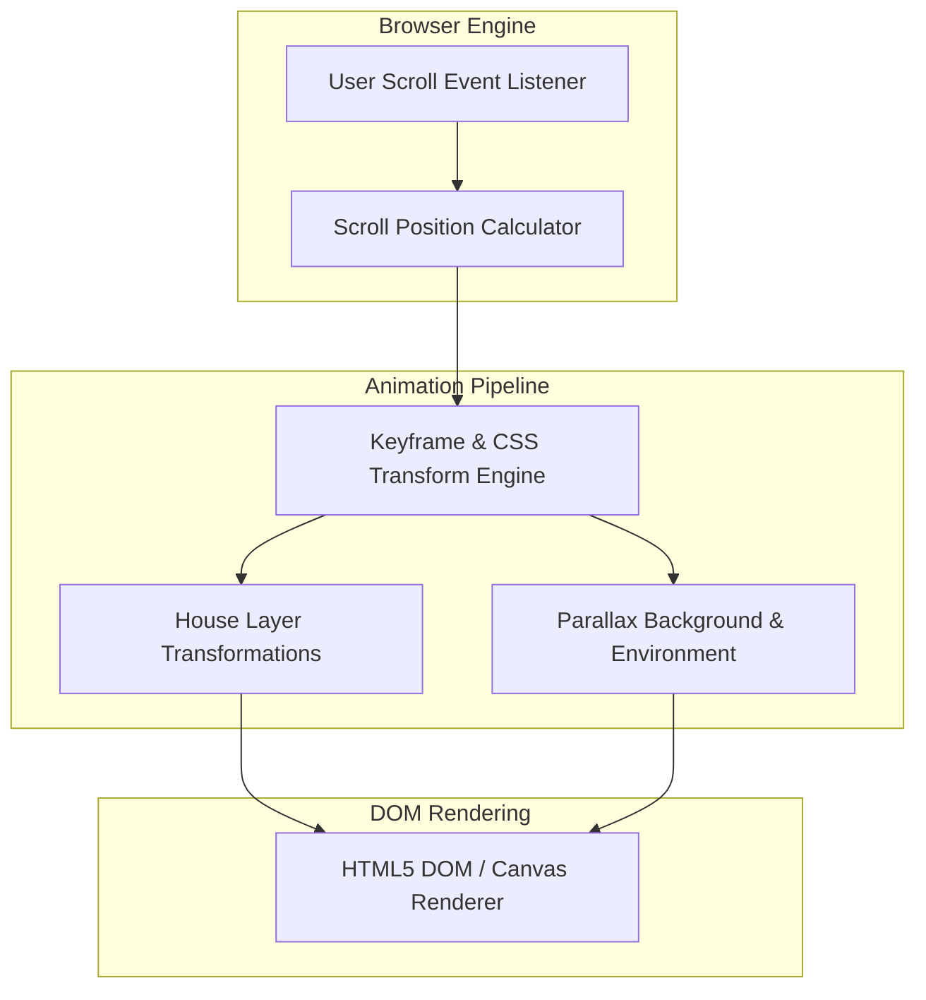
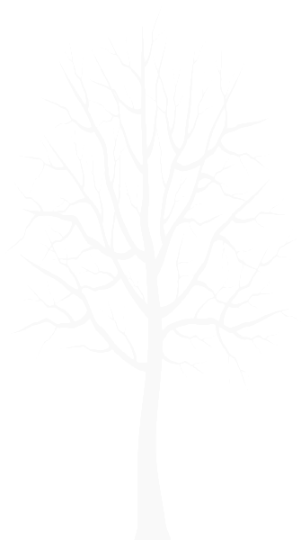

# Animated House on Scroll

Welcome to the Animated House on Scroll repository! 🏡✨

## Overview

This repository showcases a captivating scroll-triggered website featuring an animated house. Immerse yourself in a delightful journey as the house comes to life with each scroll, creating an engaging and visually pleasing experience.

## System Architecture



## Features

- **Scroll-Activated Animation:** Experience the magic of the animation unfolding seamlessly as you scroll through the page.

- **House Enchantment:** Watch as the house transforms and reveals its charm with every scroll, adding an element of surprise.

- **Responsive Design:** Enjoy the smooth animation on various devices, ensuring a delightful experience for users across platforms.

## Technologies Used

- **HTML:** The foundation of the website structure.

- **CSS:** Styling to bring life and personality to the animated elements.

- **JavaScript:** Powering the scroll-triggered animation and interactivity.

## Asset Directory & Graphic Resources

| Asset | File Type | Parallax Layer |
|---|---|---|
| `car.png` | PNG Graphic | Moving Vehicle Foreground Layer |
| `grass.png` | PNG Graphic | Base Ground Plane Texture |
| `plants.webp` | WebP Image | Garden Plants & Foreground Layer |
| `tree1.png` | PNG Graphic | Midground Vegetation |
| `tree2.png` | PNG Graphic | Background Trees |

## Visual Asset Previews

| Vehicle | Vegetation | Plants |
|:---:|:---:|:---:|
|  |  |  |

## Getting Started

1. Clone the repository:
   
```bash
   git clone https://github.com/multiverseweb/house.git
```
2. Open index.html in your preferred browser.

3. Scroll through the page to experience the enchanting house animation.

## Contributions
Contributions are welcome! If you have ideas for improvements, new features, or bug fixes, please open an issue or submit a pull request.

Feel free to reach out if you have any questions or just want to share your thoughts about this project. Happy scrolling! ✨🚀

You can view the website [here](https://multiverseweb.github.io/house/).
